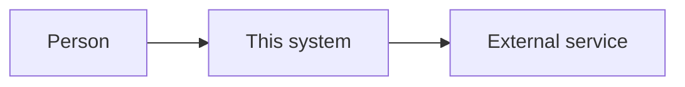
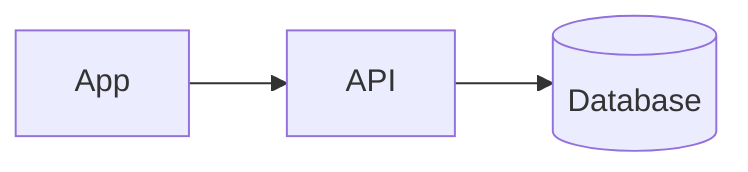

# How the parts fit

## Context

```mermaid
flowchart LR
  user[Person] --> app[This system]
  app --> ext[External service]
```

## Containers

```mermaid
flowchart LR
  ui[App] --> api[API] --> db[(Database)]
```

## Data flows

The main flows in words, one short paragraph each.
